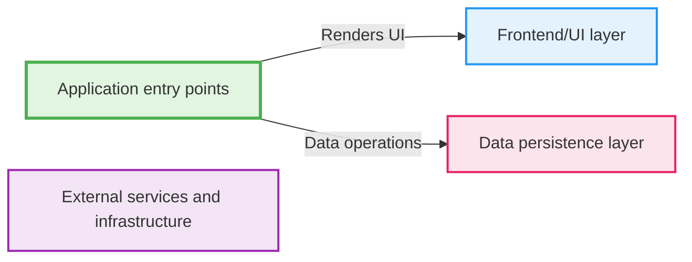
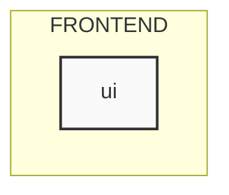

# Footballer_Classifier Analysis Report

**Owner:** Chitham24  
**Repository:** Footballer_Classifier  
**Branch:** main  
**Primary Language:** XML  

## 📋 Overview

### Purpose
* Classify footballers
* Image classification

**Architecture Pattern:** Full-stack web application (Frontend + Backend)

### Architecture
* Microservices design
* Modular components
* API-centric

## 🛠️ Technology Stack

### Languages

| Language | Files | Lines | Percentage |
|----------|-------|-------|------------|
| XML | 34 | 510,644 | 81.0% |
| Python | 3 | 121 | 7.1% |
| JSON | 2 | 2 | 4.8% |
| JavaScript | 2 | 132 | 4.8% |
| Markdown | 1 | 5 | 2.4% |

### Frameworks
- Express
- Flask
- Koa
- Vue

### Databases
- PostgreSQL
- Redis

## 🏗️ Architecture Insights

### Key Modules
* ui
* API endpoint
* Image classifier
* File uploader
* Data processor
* Database connector

### Technology Choices
* Express framework
* Vue library
* PostgreSQL database

## 📁 Repository Structure

**Total Folders:** 3

| Folder | Role | Files |
|--------|------|-------|
| `server` | ⚙️ backend | 22 |
| `ui` | 🎨 frontend | 2 |
| `model` | 📦 misc | 19 |

## 🚀 Entry Points

**Total Entry Points:** 2

### Application Files
- `ui/app.js` (JavaScript)

### Framework Entry Points
- `server/server.py` (Framework: Flask)

## 🔄 Execution Flow

### Entry Point
- app.js

### Request Flow
1. Client sends request
2. Server receives request
3. Route handler executes

### Key Interactions
- Express handles HTTP
- Koa handles errors
- Vue renders UI
- Flask provides API

## 📦 Module Summaries

### `ui` (frontend)

**Purpose:**
- Handles UI functionality
- Manages user interactions

**Key Components:**
- Dropzone
- jQuery
- API endpoint
- Image classification
- File uploads

**Interactions:**
- Sends image data
- Handles upload events

## 📊 Visual Diagrams

### Execution Flow Diagram

### Module Structure Diagram

### Dependency Graph

```mermaid
graph TD
    server_util_py[util.py]
    server_server_py[server.py]
    server_wavelet_py[wavelet.py]
    README_md[README.md]
    model_class_dictionary_json[class_dictionary.json]
    model_opencv_haarcascades_haarcascade_eye_xml[haarcascade_eye.xml]
    model_opencv_haarcascades_haarcascade_eye_tree_eyeglasses_xml[haarcascade_eye_tree_eyegla...]
    model_opencv_haarcascades_haarcascade_frontalcatface_xml[haarcascade_frontalcatface.xml]
    model_opencv_haarcascades_haarcascade_frontalcatface_extended_xml[haarcascade_frontalcatface_...]
    model_opencv_haarcascades_haarcascade_frontalface_alt_xml[haarcascade_frontalface_alt...]
    model_opencv_haarcascades_haarcascade_frontalface_alt2_xml[haarcascade_frontalface_alt...]
    model_opencv_haarcascades_haarcascade_frontalface_default_xml[haarcascade_frontalface_def...]
    model_opencv_haarcascades_haarcascade_fullbody_xml[haarcascade_fullbody.xml]
    model_opencv_haarcascades_haarcascade_lefteye_2splits_xml[haarcascade_lefteye_2splits...]
    model_opencv_haarcascades_haarcascade_licence_plate_rus_16stages_xml[haarcascade_licence_plate_r...]
    server_util_py --> server_wavelet_py
    server_server_py --> server_util_py

    classDef default fill:#f9f9f9,stroke:#333,stroke-width:2px
```

## 🔗 Dependencies

**Total Nodes:** 42  
**Total Edges:** 2  
