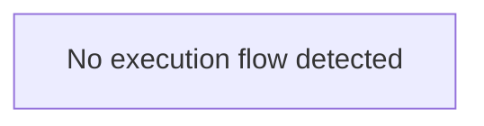
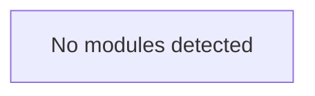

# Hello-World Analysis Report

**Owner:** octocat  
**Repository:** Hello-World  
**Branch:** main  
**Primary Language:** None  
**Stars:** ⭐ 3481  

**Description:** My first repository on GitHub!

## 📋 Overview

**Architecture Pattern:** Modular application


## 🛠️ Technology Stack


## 🏗️ Architecture Insights


## 📁 Repository Structure

**Total Folders:** 0


## 🚀 Entry Points

**Total Entry Points:** 0


## 🔄 Execution Flow


## 📊 Visual Diagrams

### Execution Flow Diagram



### Module Structure Diagram



### Dependency Graph

```mermaid
graph TD

    classDef default fill:#f9f9f9,stroke:#333,stroke-width:2px
```
