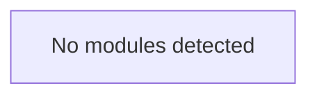

# Twilio_Whatsapp_Bot Analysis Report

**Owner:** Chitham24  
**Repository:** Twilio_Whatsapp_Bot  
**Branch:** main  
**Primary Language:** Python  

**Description:** This project is a Flask-based automation tool that uses Twilio's WhatsApp API to send personalized messages, track user responses, and send follow-up reminders if users don’t respond within 24 hours.

## 📋 Overview

**Architecture Pattern:** Modular application

## 🛠️ Technology Stack

### Languages

| Language | Files | Lines | Percentage |
|----------|-------|-------|------------|
| Python | 6 | 217 | 85.7% |
| Markdown | 1 | 63 | 14.3% |

### Frameworks
- Flask

### Databases
- Redis

## 🏗️ Architecture Insights

## 📁 Repository Structure

**Total Folders:** 0

## 🚀 Entry Points

**Total Entry Points:** 2

### Application Files
- `main.py` (Python)

### Framework Entry Points
- `server.py` (Framework: Flask)

## 🔄 Execution Flow

## 📊 Visual Diagrams

### Execution Flow Diagram

### Module Structure Diagram

### Dependency Graph

## 🔗 Dependencies

**Total Nodes:** 9  
**Total Edges:** 6  
